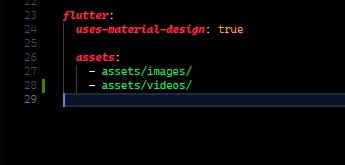

# Widgets_app

<details>
  <summary>Table of Contents</summary>

- <a href="#links-resources">Enlaces a recursos</a>
- <a href="#notes-of-widgets">Notes of Widgets</a>
- <a href="#configuration-to-use-assets">Configuration to used Assets</a>
- <a href="#notes-on-folders-and-files">Notas sobre carpetas y archivos</a>
- <a href="#configuration-for-state-management">Configuration for state management</a>
- <a href="#commands-util">Comandos útiles</a>

</details>

## Levantar el proyecto

1. Selecciona el dispositivo
2. f5 para iniciar en modo debug

```Bash
    # Proyecto creado en:
    node 16.17.0

    # en caso tengas problemas para correr el proyecto
    flutter pub get
```

## List of projects in this repository

1. Counter basic and Counter with state
2. App yes or not - chat
3. App of videos Tok Tik

En el caso del app de TokTik debes agregar la carpeta videos en assets y su contenido además configurar pubspec.yaml para recursos estáticos (ejemplo en Configuration to use Assets )

También configurar los 'permisos' para transmitir videos de internet como muestra la doc de Flutter (Enlace en 'Links to resources')

## Links to resources

- [Go router](https://pub.dev/packages/go_router)
- [Material example widgets](https://m3.material.io/develop/flutter)
- [Provider](https://pub.dev/packages/provider)
- [Riverpod](https://docs-v2.riverpod.dev/docs/concepts/about_code_generation)
- [Quicktype, format](https://quicktype.io/)
- [Videos verticales Pexels](https://www.pexels.com/search/videos/vertical/)
- [Doc Flutter - video player](https://docs.flutter.dev/cookbook/plugins/play-video)
- [Tutorial Animate_do](https://www.youtube.com/watch?v=48jIUnc1TQo&list=PLCKuOXG0bPi1E-uXVd4j2iLqkbTYaHARX&index=2)

## Notes of Widgets

### ListView() y sus tipos

El widget ListView se utiliza para construir una lista de widgets desplazables

ListView.builder: Este tipo de ListView es ideal cuando tienes una lista de elementos de longitud desconocida o muy grande. Utiliza un constructor de elementos bajo demanda, lo que significa que solo se construyen los elementos visibles en la pantalla. Esto mejora el rendimiento y la eficiencia al mostrar listas largas.

ListView.separated: Este tipo de ListView es similar a ListView.builder, pero agrega separadores entre los elementos de la lista. Puedes personalizar el separador utilizando el parámetro "separatorBuilder".

ListView.custom: Este tipo de ListView te permite tener un control total sobre la construcción de los elementos de la lista. Puedes personalizar completamente la apariencia y el diseño de cada elemento utilizando el parámetro "childrenDelegate".

### Diferencia entre Column() y Stack()

El widget Column() organiza sus elementos secundarios en una matriz vertical o columna en el eje horizontal del diseño. Esto significa que los elementos secundarios se apilan uno encima del otro en orden vertical. Es útil cuando se desea mostrar una lista de elementos o cuando se necesita una disposición vertical de widgets.

Por otro lado, el widget Stack() organiza sus elementos secundarios en una pila, donde los elementos se superponen unos sobre otros. Esto permite colocar elementos secundarios en capas y controlar su posición relativa. Es útil cuando se desea superponer elementos, como superponer un botón en la parte superior de una imagen de fondo.

En resumen, la diferencia principal entre Column() y Stack() es la forma en que organizan y muestran sus elementos secundarios. Column() los apila verticalmente, mientras que Stack() los superpone en capas. La elección entre ellos dependerá de la disposición y el diseño específico que se desee lograr en la interfaz de usuario de la aplicación Flutter.

Es importante tener en cuenta que esta explicación se basa en la documentación y ejemplos proporcionados por la comunidad de Flutter y puede haber otros detalles o casos de uso específicos que no se mencionen aquí.

## Configuration to use Assets

``` yaml
    # Para usar recursos estáticos configura:
    # Dentro de el archivo `pubspec.yaml` agrega:
    assets:
        - assets/images/
        - assets/videos/
```



## Notes on folders and files

La carpeta 'domain' se utiliza para almacenar las entidades de tu aplicación. Las entidades son objetos que representan conceptos clave en tu dominio de negocio. Por ejemplo, si estás construyendo una aplicación de comercio electrónico, podrías tener entidades como 'Producto', 'Carrito de compras' o 'Usuario'.

también puede contener otros elementos relacionados con la lógica de negocio, como interfaces de repositorio, casos de uso y validaciones. Estos elementos ayudan a definir cómo interactúan las entidades con otras capas de la aplicación, como la capa de infraestructura o la capa de presentación.

Las entidades encapsulan la lógica y el comportamiento relacionados con el dominio

La carpeta 'infrastructure' es un punto medio entre domain y presentation

## Configuration for state management

### Provider

Para consumir este state management necesitas declararlo en la parte mas alta de tu app
ó en lo mas alto de donde quieres que se consuma ese estado.

The easiest way to read a value is by using the extension methods on [BuildContext]:

```Text
context.watch<T>(), which makes the widget listen to changes on T
context.read<T>(), which returns T without listening to it
context.select<T, R>(R cb(T value)), which allows a widget to listen to only a small part of T.
```

Utiliza el 'MultiProvider' y dentro crea la instancia inicial de tu provider, si no necesitas el contexto del builder solo usa '_'

```dart
    @override
    Widget build(BuildContext context) {
        <!-- MultiProvider -->
        return MultiProvider(
        providers: [
            ChangeNotifierProvider(create: (_) => ChatProvider())
        ],
        child: MaterialApp(
            debugShowCheckedModeBanner: false,
            title: 'Yes or Not app',
            theme: AppTheme(isDarkMode: false, selectedColor: 6).getTheme(),
            home: const ChatScreen(),
        ),
        );
    }
```

### Flutter_riverpod

Para consumir un provider de `flutter_riverpod` en un `stateLessWidget`
debes Reemplazar este por un `ConsumerWidget`

```Dart
    // Example 1 to modifier the state
    ref.read(counterProvider.notifier).state++;

    // Example 2 to modifier the state
    ref.read(counterProvider.notifier)
        .update((state) => state + 1);
```

## Commands util

En caso tengas problemas para correr el proyecto con el chat ó mas de un proyecto en un mismo repo usa:

```Bash
    flutter clean
    flutter pub get
```
